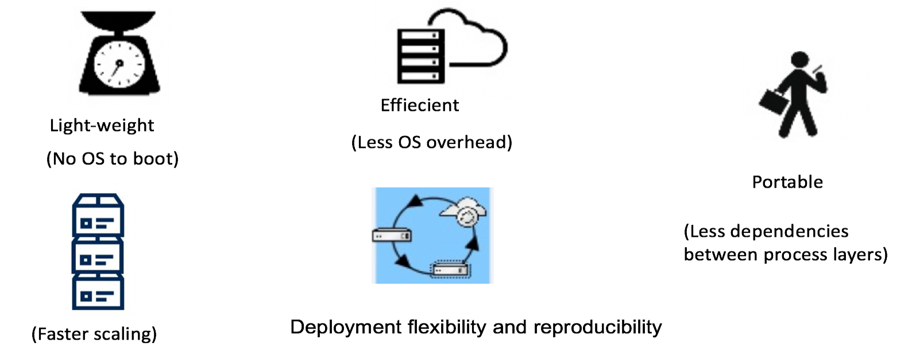
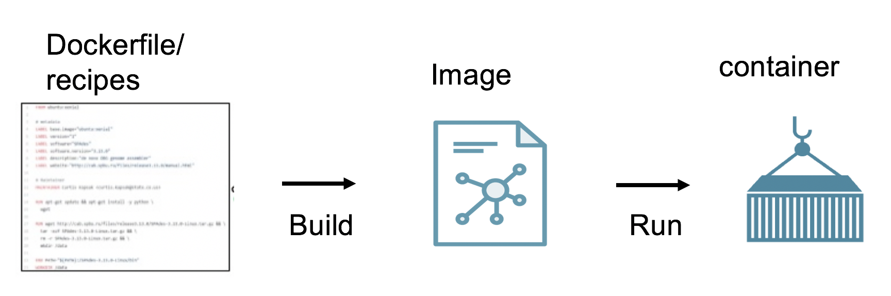
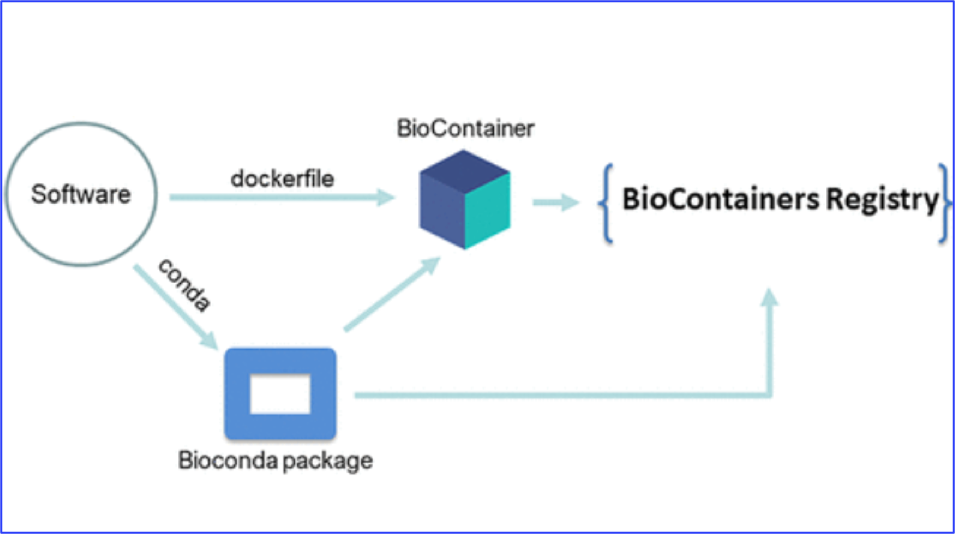
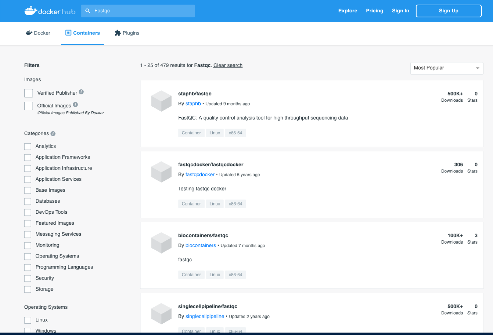

# Containerised Bioapplications in HPC Environment {.title}

<small>
All material (C) 2020-2021 by CSC -IT Center for Science Ltd.
This work is licensed under a **Creative Commons Attribution-ShareAlike** 4.0
Unported License, [http://creativecommons.org/licenses/by-sa/4.0/](http://creativecommons.org/licenses/by-sa/4.0/)
</small>

# Outline
- Why containerised bioapplications
- Biocontainers and related registries
- Deploying (running) biocontainers in HPC environment
   - Containers available as modules
   - Custom-made containers
- Mounting/binding volumes

#  
   

 **Why Containerised Bioapplications** 

# Why Containerised Bioapplications

# Some Basic Terminology

# Central Dogma of Containerisation

- Two containerisation platforms
    - Docker image built from dockerfiles
    - Singularity image built from singularity recipes (deffiles)

#  
   
     
 **Biocontainers and Related Registries** 

# Biocontainers: Bioinformatics Containers
- A community-driven effort 
- Focus is to create and manage bioinformatics software in a standardised way
- Focus on popular Omics’ methods (Genomics, proteomics, metagenomics and  metabolomics)
- Can be integrated into bioinformatics pipelines and different architectures
- Provides ready-made containers for bioinformatics community
   - [QUAY container registry](https://quay.io)
   - [DockerHub](https://hub.docker.com/)

# Biocontainers Registry (1/2)

- A hosted registry of all BioContainers images that are ready to be used 
- The interface to search BioContainers across all the registries
- Source of Biocontainer image can be conda recipe or dockerfile  
     
           
 <small> Bai J. et al. (2021) J Proteome Res. 2021 Apr 2;20(4):2056-2061 </small> 

# Biocontainers Registry (2/2)

- Growing number of open source tools
- Provides guidelines to standardize software containers
- Current status: 10.4K tools, 44.2K versions and 213.2K containers/packages 
- Explore more at [Biocontainers Registry](https://biocontainers.pro)

# DockerHub
 - [A registry from Docker, Inc.](https://hub.docker.com/bio) 
 - A centralized management of user accounts and image chesums 
 - Hosts both public/private repositories
 - Not all docker images can work smoothly with Singularity
     - Containers running under *root* 
     - Containers starting with *entrypoint scripts*
     
# DockerHub Screen Shot

 

# QUAY Container Registry
- Quay.io is a container registry for docker images
- A scalable open source platform to host container images across any size organization
- You can create your own public repositories
- Provides CI support for automated builds for BioConda GitHub
- All biocontainers are docker-based and are publicly available for free 

# Cloud Library from Sylabs

- A registry for hosting singularity images
- Cloud library is the official image registry provided by Sylabs.io
- Provides container service including remote image building
- The images should work normally on HPC systems
- Explore more on the home page of [Cloud Library](https://cloud.sylabs.io/library)

# Other Singularity-based Resources
 - [SingularityHub](https://singularityhub.github.io/singularityhub-docs/): no longer hosts online image building service, but exists as a read only archive
 - Syntax for pulling an image from the registry:  *singularity pull shub://*
 - Biocontainers repositories
    - [Biocontainers SingImgRepo](https://containers.biocontainers.pro/s3/SingImgsRepo/)
    - [Galaxy singularity](https://depot.galaxyproject.org/singularity/)

#  

   
     
 **Deploying Biocontainers in HPC Environment** 

# Qualified Reference URI for Image
- A qualified image URI  consists of three main components:
     - image prefix: library/shub/docker
     - a registry location (hostname)
     - a username (namespace)
     - a image name (reponame)
- Full URI template: Prefix://hostname[:port]/username/imagename[:tag]
    -  For DockerHub registry,  docker://username /image name[:tag]
    -  For QUAY container registry,  docker://quay.io/username/image name[:tag]

# Working with Containers in CSC HPC Environment

 - Singualrity is installed on Puhti  (no need to load any modules)
 - Available options:	
   - Using modularised container (pre-installed for you in Puhti)
       - Examples: *Rstudio, Chip-Seq-Pipeline, CrossMap, Cutadapt, EAGER, QIIME1, Jupyter, BRAKER, aTRAM and METABOLIC*
   - Using custom-made container (your own image or dowloaded from container registry)
       - Any biocontainer, deepvariant, GATK ...

# Getting Started with a Modularised Container

- Load a module on Puhti/Mahti
    - e.g., module load Cutadapt
- Module command sets  some environment variables on host  machine
    - e.g., SING_IMAGE and SING_FLAGS 
- Use singularity_wrapper  which has advantages than plain singularity command
    - singularity_wrapper exec command_to_run
- Mounting datasets with SquashFS
   - when input files are too many

# Getting Started with a Custom-made Container

- Either pulling an image from registry or preparing one by yourself
- Pull/Build an image from registry repositories using singularity command
     - *singularity  pull   hello-world.sif   shub://vsoch/hello-world*
     - *singularity  build   r-base-latest.sif   docker://r-base*
- Note:Use URI prefix with:
     - library:// for Container Library.
     - docker:// for Dockerhub/Quay.io. 
     - shub:// for Singularity Hub.
- Executing a command
     - use *singularity* or *[singularity_wrapper](https://docs.csc.fi/computing/containers/run-existing/)* 

#
   
     
**Mounting/Binding Host Volume**

# Why Mounting/Binding Host Volumes 
 - No data persistence in container file systems
 - Can’t share any data with other containers/volumes 
 - Containers are stateless 
 - Decoupling container from storage

# Mounting/Binding Host Volumes
 - Volume: Volumes are like directories. Name comes from the enterprise use-case. 
 - Note that you can only mount few  directories on HPC systems
      - HOME, PROJAPPL, SCRATCH
 - Binding/Mapping
      - You can bind/map directories from the host machine into a guest container
      - *singularity run -B /path/inside/host:/path/inside/conntainer  singularity_image.simg*

#
   
     
**Time for Tutorials: BLAST   DeepVariant**

