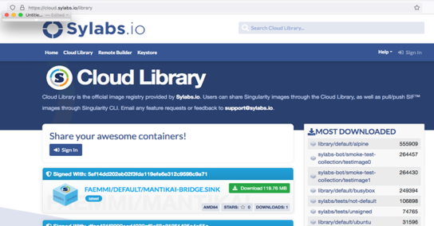

# Containerised Bio Applications in HPC Environment {.title}
In this section, you will learn how to manage different disk areas in HPC environment at CSC

<small>
All material (C) 2020-2021 by CSC -IT Center for Science Ltd.
This work is licensed under a **Creative Commons Attribution-ShareAlike** 4.0
Unported License, [http://creativecommons.org/licenses/by-sa/4.0/](http://creativecommons.org/licenses/by-sa/4.0/)
</small>

# Outline
- Basic introduction to (Bio)container 
- Searching pre-existing biocontainers 
- Deploying (running) biocontainers in HPC environment
   - Containers available as modules
   - Custom-made containers
- Mounting/binding volumes
- Bioapplication examples

# Topic 

Basic Introduction to (Bio)containers

# Some Basic Terminology

- **Image**: self-contained snapshot of your full application,packages and dependencies
- **Container**:  A running instance of an image
- **Container Engine**:Creates, ships and runs  containers deployable on a physical or  virtual, host locally, in a datacenter or cloud service provider
- **Registry Service**: Cloud or server based storage and distribution service for your images

# Some Basic Terminology

# Moving data between and to/from supercomputers

- Puhti and Mahti have their own disk systems
- Data can be moved between the supercomputers 
    - [directly with rsync](https://docs.csc.fi/data/moving/rsync/) 
    - via [Allas object storage](https://docs.csc.fi/data/Allas/)
- There are [many ways to transfer data to/from CSC and your local computer](https://docs.csc.fi/data/moving/)

# Central Dogma of Containerisation

- Two containerisation platforms
    - Docker image built from dockerfiles
    - Singularity image built from singularity recipes (deffiles)

# Topic 

Biocontainers and Related Registries

# Biocontainers: Bioinformatics Containers
- A community-driven effort 
- Focus is to create and manage bioinformatics software containers
- Focus on popular Omics’ methods (Genomics, proteomics, metagenomics, metabolomics)
- Can be integrated into bioinformatics pipelines and different architectures
- Provides ready-made containers for bioinformatics community
   - [QUAY registry](https://quay.io)
   - [DockerHub](https://hub.docker.com/)

# Biocontainers Registry (1/2)

- A hosted registry of all BioContainers images that are ready to be used 
- The interface to search BioContainers across all the registries.
- Source of Biocontainer image can be conda recipe or dockerfile
  

# Biocontainers Registry (2/2)

- Growing number tools
- current status: 10.4K tools; 44.2K versions and 213.2K containers and packages 
- Explore more at Biocontainers Registry(https://biocontainers.pro)
- 

# DockerHub
 - [A registry from Docker](https://hub.docker.com/bio) 
 - A centralized management of user accounts and image chesums 
 - Hosts both public/private repositories
 - Not all images can work smoothly with Singularity
     - Applications with root access
     - Applications with entrypoints
     
# DockerHub Screen Shot

 

# QUAY Container Registry
- Quay.io is a container registry from Red Hat
- A scalable open source platform to host container images across any size organization
- Create your own public repositories
- Provides CI support for automated builds for BioConda GitHub
- All Biocontainers are docker-based and are publicly available for free 

# Cloud Library from Sylabs

- Cloud Library is the official image
     registry provided by Sylabs.io
- [A singularity hub](https://cloud.sylabs.io/library 
- Images should work normally on HPC systems

# What are the different disk areas for?

- [Allas](https://docs.csc.fi/data/Allas/) - for data which is not actively used
- [HOME](https://docs.csc.fi/computing/disk/#home-directory) - small, thus only for most important (small) files, personal access only
- [scratch](https://docs.csc.fi/computing/disk/#scratch-directory) - main working area, can be used to share with project members
- [projappl](https://docs.csc.fi/computing/disk/#projappl-directory) - not cleaned up, e.g. for shared binaries 
- [Login node local tmp](https://docs.csc.fi/computing/disk/#login-nodes) - compiling, temporary, fast IO 
- [NVMe](https://docs.csc.fi/computing/running/creating-job-scripts-puhti/#local-storage) - fast IO in batch jobs

# Some best practice tips

- Don't put databases on Lustre (projappl, scratch, home) 
    - use other CSC services like [kaivos](https://docs.csc.fi/data/kaivos/overview/) or mongoDB in cPouta
- Don't create a lot of files in one folder
- Don't create overall a lot of files (if you're creating tens of thousands of files, you should probably rethink the workflow)
- Take backups of important files. Data on CSC disks is not backed up even if systems are fault tolerant.
- When working with the large number of smaller files, consider using fast local disks
- [Best practice performance tips for using Lustre](https://docs.csc.fi/computing/lustre/#best-practices)
