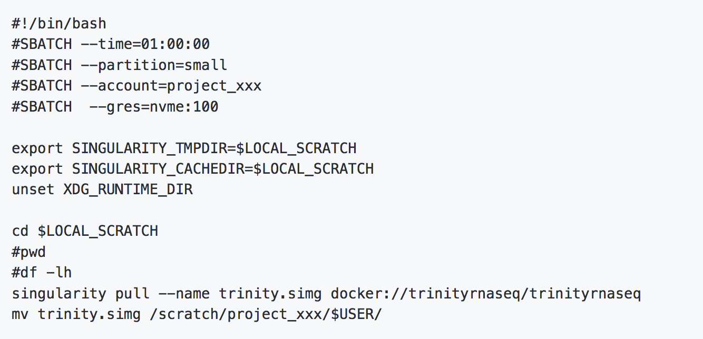

# Converting Docker Images to Singularity {.title}

<small>
All material (C) 2020-2021 by CSC -IT Center for Science Ltd.
This work is licensed under a **Creative Commons Attribution-ShareAlike** 4.0
Unported License, [http://creativecommons.org/licenses/by-sa/4.0/](http://creativecommons.org/licenses/by-sa/4.0/)
</small>

# Outline
- Brief introduction to Docker vs. Singularity  images
- Deploying singularity containers from docker images
- HPC disk systems and efficient image conversion 
- Good practice tips in converting images

#  
   

 **Brief introduction to Docker *vs.* Singualrity  images** 

# Primer on Pre-built Docker Images 

- The docker is a leading container platform  and is widely adopted in industry/cloud applications
- Plenty of images are archived in docker registries
- Provides even GPU-accelerated solutions 
- Handy when directly building Singularity image seems more difficult
- Good news: Singularity nicely integrates with docker images
- Challenge: Some docker images may not work smoothly with singularity

# Docker vs. Singularity Images
- Docker image
     - Image is a layered structure 
     - Stored in the local image cache  when using docker client
     - Saves some space by sharing some layers across different local images when storing 
     - Caching the build layers can speed up the build process
- Singularity image
     - Single image file (.sif) / images are flat 
     - Stored as a normal file
     - Easy portability : transferring and sharing images across a cluster is very easy
     - Image can be used as binary (./image.sif)
     
 
# Docker Essentials for Image Modification

- Find the ID of an image
     - *Docker images*   
- Build a container image from Dockerfile
     - *docker build -t  &lt;image repository&gt;:&lt;image tag &gt;    . *  
- Start an interactive bash session
     - *docker run  -it    &lt;image &gt;    /bin/bash* 
- Create an image from running container
     - *docker commit     &lt;Container ID&gt;     &lt;image repository&gt;:&lt;image tag &gt; * 
- Save image tar file locally
     - *docker save -o  &lt;repo_tag.tar &gt;    &lt;image repository:tag&gt;*

#  
   
     
 **Deploying Singularity Containers from Docker Images ** 

# Running Singularity Containers from Public Docker repositories
- Use Singularity subcommands
    - *singularity pull …*
    - *singularity build …*
    - *singularity build* command is functionally equivalent to *singularity pull* but *build* command does more (like making a writable image) 
- Examples: 
    - *singularity pull docker://biocontainers/comet:v2016011_cv5*
    - *singularity build docker://biocontainers/comet:v2016011_cv5*
    - *singularity build --sandbox mycomet_sandbox docker://biocontainers/comet:v2016011_cv5*

# Running Singularity Containers from Private Docker repositories
- One can create a private repository in docker registry
- Authentication is required before pulling an image from private repo
- Usage: *singularity pull --docker-login docker://privaterepo/imagename:tag*
    - export SINGULARITY_DOCKER_USERNAME=username
    - export SINGULARITY_DOCKER_PASSWORD=password

- Finally, test if the converted image works:  *./imagename.sif*

# Running Singularity Containers from Local Docker Images
- Pre-built docker images may not work or does not meet our needs 
- Modify and save docker image from local machine as tar file
    - Usage: *sudo docker save &lt;image_id &gt; -o local_docker.tar*
- Then copy tar file from local machine to HPC environment 
- Finally, build a singularity image using *docker-archive* command
     - *singularity  build  local_singularity_image.sif  docker-archive://local_docker.tar*

# Sharing Images via Registries
- Sharing images without registries is usually discouraged
- Share your images via registries and maintain proper codes in GitHub/Gitlab
- Sharing via registries requires pushing your image to registry
- Production images needs to be properly named and tagged 

# Reminder: Take care of Sinularity Cache in Puhti
- Default location: $HOME/.singularity
     - Disk space in $HOME in HPC systems is limited for a user
     - Your $HOME directory can be quickly filled up, causing disk space issues 
- One can configure Singularity directories using two environment variables: 
     - SINGULARITY_CACHEDIR: Cache folder for images from a container registry.
     - SINGULARITY_TMPDIR: Temporary directory to build container file-systems.
- Useful tips:
     - singularity cache list  # show storage capacity used by the cache
     - singularity cache clean # clean up everything 

#  

   
     
  **HPC Disk Systems and Efficient Image Conversion** 
 

# Disk and Storage Overview
 {width=90%}

# NVMe Disks for Faster Image Conversion
- Use only when working with bigger images
- Not all compute nodes have these NVMe disks
- You can request these resources in batch script/interactive node
- Use the environment variable $LOCAL_SCRATCH to access local storage on compute node
- In batch jobs, remember to copy the files back to your scratch folders

# Tiny batch script that uses NVMe disks
- Image conversion example
 {width=90%}

#  

   
     
       **Good Practice Tips in Image Conversion** 

# Good Practice Tips in Image Conversion (1/2)

- Maintain tags of the image (reproducibility!)
     - generic URI for docker: *docker://&lt;user &gt;/&lt;repo-name &gt;[: &lt;tag &gt;]*
     - developers release several different versions of the same container with different tags
- Hashes  are even more unique 
     - Always pull the same image: *library://debian:sha256.b92c7fdfcc615*
- Pay attention to special tag: latest
     - pulling an image with latest: *singularity pull library://debian:latest*

# Good Practice Tips in Image Conversion (2/2)

- Don’t use any image that would be running under root
     - Works fine in docker world and results in bugs in singularity
- If you modify an image,  don’t install to $HOME or $TMP
- Docker images with ENTRYPOINT scripts are usually broken
     - ENTRYPOINT [ "entrypoint_script.sh" ]

#
   
     
**Time for Tutorials**:        Conversion of docker images from registries   Local image conversion   Efficient image conversion 

